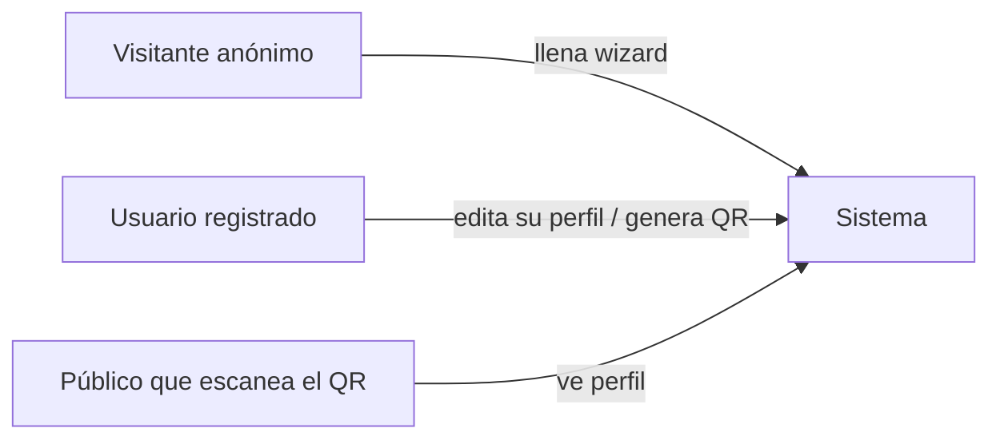
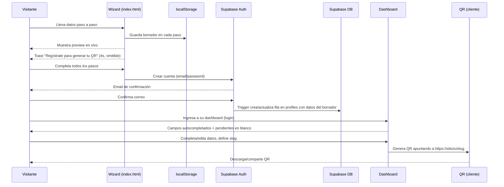
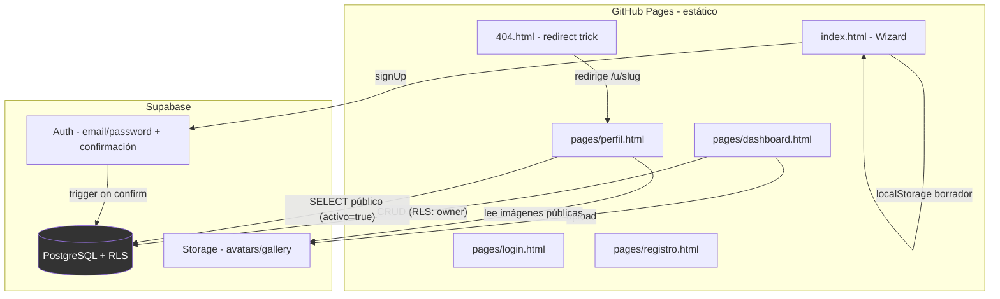
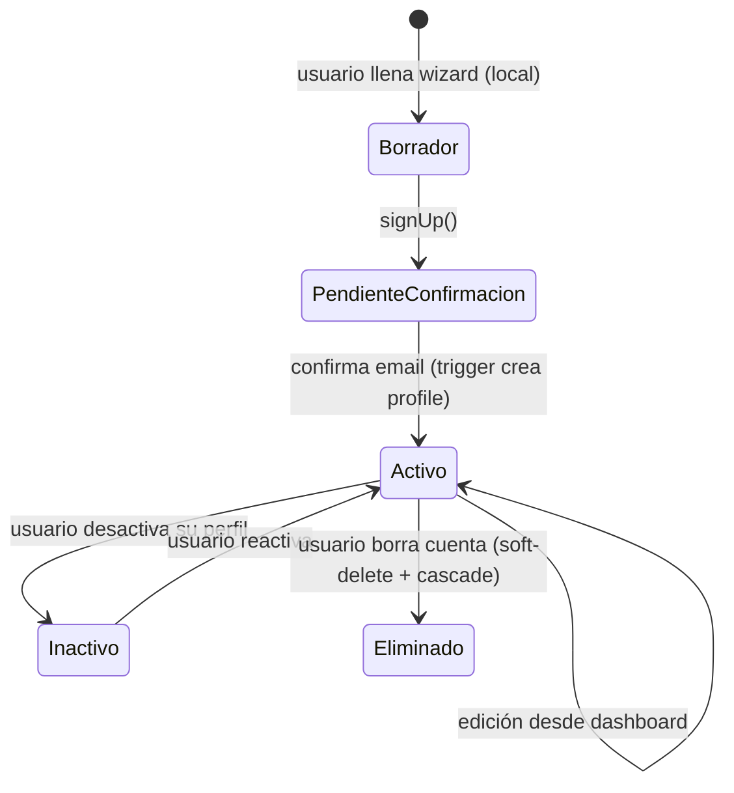
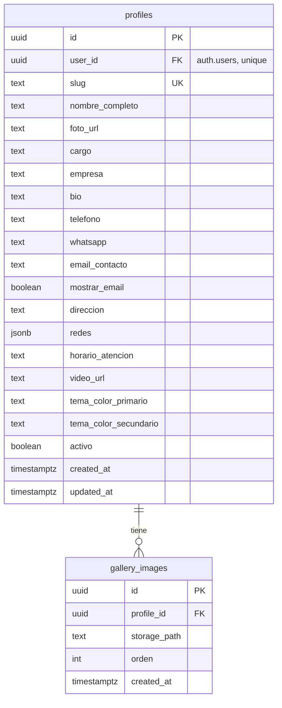

# 🏗️ ARQUITECTURA — SISTEMA DE TARJETA PERSONAL (vCard) + QR

**Proyecto:** VCard-QR (nombre provisional) · **Versión:** 1.0 · **Fecha:** 2026-07-17
**Framework:** RFC → PRD → System Design → Tech Spec → ADRs (según PLANTILLA-MAESTRA-ARQUITECTURA-SISTEMAS.md)

---

## 1. RFC

### 1.1 Problema
Servicios tipo qr-code.io ofrecen tarjetas de presentación digitales + QR, pero con muchos planes de pago, pasos y opciones que un usuario individual no necesita. Luis quiere una versión simplificada, 100% gratuita, que cualquier persona pueda usar para crear su página personal y compartir un QR único.

### 1.2 Propuesta
Sitio estático (GitHub Pages) + Supabase (Auth, DB, Storage) donde el usuario llena un formulario tipo wizard con preview en vivo, se registra para confirmar sus datos, y obtiene una URL pública (`/u/slug`) + un código QR generado en el cliente que apunta a esa URL. Sin costos de servidor, sin pasarela de pago.

### 1.3 Alternativas evaluadas
| Alternativa | Por qué se descartó |
|---|---|
| Backend propio (Node/Express + DB propia) | Costo de hosting, mantenimiento; Supabase free tier cubre todo lo necesario |
| QR generado por API externa de pago | Existen librerías JS gratuitas (qrcode.js) que generan el QR 100% en cliente |
| URLs por carpeta física generada en build | No hay build dinámico en GH Pages; se resuelve con query param + trick de `404.html` |
| B. Elegida: estático + Supabase + QR client-side | — |

### 1.4 Riesgos e impactos
| Riesgo | Probabilidad | Impacto | Mitigación |
|---|---|---|---|
| Abandono del wizard antes de registrarse | Alta | Media (no hay lead) | Guardar borrador en `localStorage`; toast de recordatorio no bloqueante |
| Slugs duplicados/ofensivos | Media | Baja | Validación de unicidad vía RPC + lista de palabras reservadas |
| Abuso de Storage (fotos grandes) | Media | Media | Límite de tamaño/formato en cliente + política de bucket |
| Suplantación (usar datos de otra persona) | Baja | Media | Confirmación de email obligatoria antes de publicar perfil |
| Límite free tier Supabase (500MB DB / 1GB storage / 50k MAU) | Baja (fase inicial) | Alta si crece | Monitoreo de cuotas (Runbook 6.6), compresión de imágenes |

### 1.5 Alcance de esta RFC
Aprueba: wizard público, registro/login con Supabase Auth, dashboard de edición, perfil público, generación de QR. Fuera de esta RFC: planes de pago, dominios propios, analítica avanzada, notificaciones por email/SMS propias (se usa solo el correo de confirmación de Supabase Auth).

---

## 2. PRD

### 2.1 Problema y oportunidad
Cualquier persona (freelancer, comerciante, profesional) necesita compartir su información de contacto de forma moderna y rápida mediante un QR, sin pagar ni configurar nada técnico.

### 2.2 Usuarios y roles



| Rol | Permisos | Superficie |
|---|---|---|
| Visitante anónimo | Llenar wizard, ver preview, NO persiste en DB | `index.html` |
| Usuario registrado | CRUD de su propio perfil, galería, generar QR | `dashboard.html` |
| Público (sin cuenta) | Solo lectura del perfil activo | `pages/perfil.html` / `/u/slug` |

### 2.3 Historias de usuario
| # | Como... | Quiero... | Para... | Prioridad |
|---|---|---|---|---|
| 1 | Visitante | llenar mis datos paso a paso viendo el preview | confiar en cómo se verá mi tarjeta | P0 |
| 2 | Visitante | poder ignorar el aviso de registro varias veces | terminar de llenar mis datos a mi ritmo | P0 |
| 3 | Visitante | crear mi cuenta al final del wizard | guardar mis datos y poder generar mi QR | P0 |
| 4 | Usuario | confirmar mi correo | activar mi cuenta y publicar mi perfil | P0 |
| 5 | Usuario | editar cualquier campo después de registrarme | mantener mi información actualizada | P0 |
| 6 | Usuario | elegir un slug único legible | compartir un link fácil de recordar | P0 |
| 7 | Usuario | generar y descargar mi QR | imprimirlo o compartirlo digitalmente | P0 |
| 8 | Público | ver el perfil y guardar el contacto (.vcf) | agregarlo a mis contactos del teléfono | P0 |
| 9 | Usuario | subir fotos a una galería y un video | enriquecer mi presentación | P1 |
| 10 | Usuario | definir horario de atención | informar disponibilidad | P1 |

### 2.4 Funcionalidades por módulo y fase
**P0 (v1):** Wizard público con preview live + toast de aviso · Auth (registro/login/confirmación/recuperar contraseña) · Autocompletado de datos del wizard al perfil tras registro · Dashboard de edición (todos los campos) · Validación de slug único · Generación de QR (cliente) apuntando a `/u/slug` · Perfil público responsivo · Botón "Guardar contacto" (.vcf) · Galería de fotos con compresión automática (ver ADR-005) · Video embebido (YouTube/Vimeo URL) · Horario de atención.

**P1 (v2):** Reordenar fotos de galería (drag & drop) · Estadísticas de escaneo del QR · Dark mode (evaluado y descartado por ahora: la paleta pastel requiere alto contraste consistente, ver sección de diseño).

**P2 (v3):** Planes premium · Dominios personalizados · Estadísticas de escaneo del QR · Multi-idioma.

**Fuera de alcance (todas las fases):** Pasarela de pagos, apps móviles nativas, mensajería SMS.

### 2.5 Métricas de éxito
| Métrica | Meta corto plazo | Meta 12 meses |
|---|---|---|
| Wizards completados hasta el paso final | 40% | 65% |
| Conversión wizard → cuenta confirmada | 25% | 45% |
| QR generados por usuario activo | 1 | 1.2 (regenera/actualiza) |
| Error rate en operaciones CRUD | <2% | <0.5% |

### 2.6 Flujo principal del producto



### 2.7 Supuestos y dependencias
- Supabase free tier es suficiente para el volumen esperado en fase inicial (ADR-002).
- GitHub Pages no ejecuta servidor: toda lógica de negocio no sensible vive en cliente + RLS de Postgres (ADR-001).
- El usuario acepta que su perfil es público en cuanto está `activo = true` (se explicita en el wizard).

---

## 3. SYSTEM DESIGN

### 3.1 Diagrama de componentes



**Frontera de confianza:** el navegador nunca usa `service_role_key`. Toda escritura pasa por RLS con `auth.uid()`. El wizard antes del registro NO escribe en Postgres (solo `localStorage`), evitando filas huérfanas sin dueño.

### 3.2 Máquina de estados — perfil



### 3.3 Flujos de datos críticos
- **Registro con datos de wizard:** el borrador en `localStorage` se envía como `user_metadata` en `signUp()`; un trigger de Postgres (`handle_new_user`) en `auth.users` crea la fila en `profiles` en la misma transacción de confirmación, evitando doble escritura desde el cliente.
- **Validación de slug único:** función RPC `check_slug_available(slug)` (SECURITY DEFINER) consulta sin exponer toda la tabla; el UNIQUE constraint en DB es la garantía final (defensa en profundidad).

### 3.4 Escalabilidad
| Punto de presión | Diseño que lo resuelve |
|---|---|
| Lectura de perfiles públicos (viral por QR) | Índice único en `slug`, política RLS simple (`activo = true`), sin joins costosos |
| Imágenes de galería y avatar | Compresión/redimensión 100% en cliente antes de subir (ver análisis abajo y ADR-005) |
| Crecimiento de usuarios | Auth + Postgres de Supabase escalan horizontalmente sin cambio de arquitectura hasta el límite del plan |

#### Análisis de capacidad de Storage (free tier = 1GB)

Sin compresión, el peor caso por usuario era: 6 fotos × 2MB + 1 avatar × 3MB = **15MB/usuario** → el free tier se agotaría con solo **~68 usuarios** al máximo. Esto es insuficiente para un sistema donde "no seremos pocos los que lo usemos".

**Mitigación implementada (ADR-005):** toda imagen se redimensiona y comprime en el navegador (canvas → JPEG) antes de subirse:

| Imagen | Límite original aceptado | Redimensión | Calidad JPEG | Tamaño típico resultante |
|---|---|---|---|---|
| Avatar | 3MB | máx. 512px de lado | 0.82 | ~40-120 KB |
| Foto de galería | 2MB | máx. 1080px de lado | 0.72 | ~150-350 KB |

Con esto, el peor caso real por usuario baja a: 6 × 350KB + 120KB ≈ **2.2MB/usuario** → el mismo 1GB gratis alcanza para **~450 usuarios** llenando galería al máximo, y muchos más en la práctica (la mayoría sube 0-2 fotos, no 6). Se añade además un tope de seguridad post-compresión (`POST_COMPRESION_MAX_KB = 700`) que rechaza el caso raro de una imagen que no comprime bien.

**Plan de monitoreo (ver Runbook en SETUP.md):** revisar mensualmente el uso de Storage en el panel de Supabase. Al llegar a ~80% (800MB), opciones en orden de preferencia: (1) bajar `GALERIA_MAX_FOTOS` en `config.js` para nuevos usuarios, (2) subir a Supabase Pro (100GB, USD 25/mes) si el crecimiento lo justifica, (3) migrar imágenes antiguas a un proveedor externo con free tier propio (ej. Cloudinary 25GB) como paso intermedio.

### 3.5 Seguridad
- RLS habilitado en el 100% de las tablas (`profiles`, `gallery_images`).
- Perfil público expone únicamente columnas necesarias vía política `SELECT ... USING (activo = true)`; el dueño ve todas sus columnas incluidas las privadas (email de contacto se muestra solo si el usuario lo marca visible).
- `service_role_key` nunca en el repositorio ni en el cliente.
- Auditoría mínima: `updated_at` con trigger automático en cada tabla.
- Anti-abuso: Supabase Auth ya limita intentos de login/registro (rate limit nativo).

### 3.6 Dependencias externas y sus fallos
| Dependencia | Si falla... | Comportamiento degradado |
|---|---|---|
| Supabase Auth | No se puede registrar/logear | Wizard sigue funcionando en modo preview local; mensaje claro de error |
| Supabase DB | Dashboard/perfil no cargan | Mostrar estado de error con reintento; perfil ya cacheado en navegador sigue visible si se guardó `localStorage` |
| Supabase Storage | Fotos no cargan | Placeholder de avatar por defecto |
| CDN de qrcode.js | QR no se genera | Fallback: mostrar el link en texto para copiar manualmente |

---

## 4. TECH SPEC

### 4.1 Stack
| Capa | Tecnología | Notas |
|---|---|---|
| Frontend | HTML5 + CSS3 + JS ES Modules (vanilla) | Sin build step, compatible GitHub Pages |
| Backend | Supabase (Postgres + Auth + Storage + RLS) | Free tier: 500MB DB, 1GB storage, 50k MAU (ADR-002) |
| QR | `qrcode` (davidshimjs/qrcodejs o qrcode.js vía CDN) | Generado 100% en cliente, gratis |
| Hosting | GitHub Pages | Estático, HTTPS gratis |

### 4.2 Estructura de carpetas
```
Personal-vcard-web/
├── index.html                  # Wizard público + preview
├── 404.html                    # Trick de URLs bonitas /u/slug
├── pages/
│   ├── login.html
│   ├── registro.html
│   ├── dashboard.html
│   └── perfil.html             # Perfil público (?u=slug)
├── assets/
│   ├── css/ (variables, styles, components, responsive)
│   ├── js/  (config, supabase-client, supabase-data, auth, wizard,
│   │         dashboard, perfil, qr, vcard, utils, main)
│   └── sql/ (schema, rls-policies, functions, migrations/)
├── docs/
│   └── ARQUITECTURA-VCARD.md   # Este documento
├── .env.example
├── README.md
├── SETUP.md
└── ARCHITECTURE.md
```

### 4.3 Modelo de datos



Convenciones: snake_case, UUID PK (`gen_random_uuid()`), `created_at`/`updated_at` en todas, soft-delete vía `activo`.

### 4.4 APIs / funciones de servidor
| Función | Trigger | Qué hace | Garantías |
|---|---|---|---|
| `handle_new_user()` | AFTER INSERT/UPDATE en `auth.users` (on confirm) | Crea fila en `profiles` desde `raw_user_meta_data` del wizard | Atómico, idempotente (upsert por `user_id`) |
| `check_slug_available(slug text)` | RPC pública | Devuelve boolean sin exponer datos de otros perfiles | SECURITY DEFINER, solo lectura |
| `set_updated_at()` | BEFORE UPDATE en `profiles`/`gallery_images` | Actualiza `updated_at` | Determinístico |

### 4.5 Permisos (RLS) por tabla
| Tabla | SELECT | INSERT/UPDATE/DELETE | Notas |
|---|---|---|---|
| `profiles` | Público si `activo=true`; dueño siempre ve la suya | Solo `auth.uid() = user_id` | Email de contacto oculto si `mostrar_email=false` (se filtra en la vista JS, no en RLS) |
| `gallery_images` | Público si el perfil asociado está activo | Solo dueño del `profile_id` | Cascade delete al borrar el perfil |
| Storage `avatars`/`gallery` (buckets) | Lectura pública | Escritura solo en carpeta `{user_id}/...` | Política estándar de Supabase Storage |

### 4.6 Integraciones externas
| Necesidad | Elegida | Free tier | Fallback |
|---|---|---|---|
| Auth + email de confirmación | Supabase Auth | Incluido | — |
| Generación de QR | Librería JS cliente (CDN) | Gratis, sin límite | Mostrar link en texto |
| Fuentes | Google Fonts | Gratis | System fonts |

### 4.7 Parámetros de negocio (tabla de configuración, cero hardcode)
Se define constantes editables en `assets/js/config.js` (no hay panel de "negocio" en v1 porque no hay precios/comisiones): dominio base del sitio, límites de galería (cantidad/tamaño), lista de redes sociales soportadas, tiempo del toast (4000ms), textos del toast. Documentado como TODO si en v2 se requiere tabla `configuracion` en DB.

### 4.8 Preguntas abiertas
| # | Pregunta | Módulo que bloquea | Respuesta sugerida |
|---|---|---|---|
| 1 | ¿Nombre final del proyecto/dominio? | Branding, `config.js` | Definir antes de publicar; usar "QR Personal System" como placeholder |
| 2 | ¿Se permite cambiar el slug después de compartir el QR? | Dashboard | No permitir cambio libre (rompe QRs ya impresos); solo soporte manual |
| 3 | ¿Paleta de colores de marca? | CSS variables | Se usa paleta azul/índigo premium por defecto, editable en `variables.css` |

---

## 5. ADRs

### Índice
| # | Decisión | Estado |
|---|---|---|
| 001 | Backend serverless con Supabase, sin servidor propio | Aceptado |
| 002 | QR generado 100% en el cliente | Aceptado |
| 003 | URLs bonitas `/u/slug` vía trick de `404.html` en GitHub Pages | Aceptado |
| 004 | Datos del wizard viajan en `user_metadata` hasta confirmación de email | Aceptado |
| 005 | Compresión de imágenes en cliente antes de subir a Storage | Aceptado |
| 006 | Tema de color por perfil, elegido en sección "Diseño" | Aceptado |
| 007 | Avatar elegido antes de tener cuenta viaja como miniatura base64 en `user_metadata` | Aceptado |
| 008 | Fuentes (título/texto) desde lista blanca de Google Fonts, cargadas dinámicamente | Aceptado |

**ADR-001 — Backend serverless con Supabase**
- Contexto: GitHub Pages solo sirve estáticos; se necesita Auth + DB + Storage sin costo.
- Decisión: usar Supabase completo (Auth, Postgres, Storage) con RLS como única capa de autorización.
- Alternativas descartadas: backend propio (costo/mantenimiento), Firebase (menos control SQL/RLS).
- Consecuencias: (+) gratis, rápido de implementar, RLS robusto. (−) límites de free tier a vigilar (Runbook 6.6).

**ADR-002 — QR generado en cliente**
- Contexto: servicios de QR de pago cobran por escaneo o cantidad.
- Decisión: usar librería JS (qrcode.js) para generar el QR en el navegador del usuario, sin llamada a API externa.
- Alternativas descartadas: API de terceros (costo/latencia/dependencia).
- Consecuencias: (+) 100% gratis y offline-capable. (−) no hay analítica de escaneos nativa (se deja para v3).

**ADR-003 — URLs bonitas con trick de 404.html**
- Contexto: GitHub Pages no soporta rutas dinámicas del lado servidor.
- Decisión: `404.html` captura cualquier `/u/slug` y redirige a `pages/perfil.html?u=slug` preservando el path original vía `sessionStorage`.
- Alternativas descartadas: solo usar `?u=slug` (funciona, pero menos "premium" para compartir).
- Consecuencias: (+) URL memorable para el QR. (−) primer salto genera una redirección extra (imperceptible para el usuario).

**ADR-004 — Datos de wizard en `user_metadata` hasta confirmación**
- Contexto: evitar filas de `profiles` sin dueño confirmado (spam/cuentas fantasma).
- Decisión: el wizard no escribe en `profiles` hasta que el trigger de confirmación de email lo haga desde `raw_user_meta_data`.
- Alternativas descartadas: insertar en `profiles` antes de confirmar (requiere limpieza de huérfanos).
- Consecuencias: (+) datos siempre ligados a una cuenta válida. (−) el dashboard debe manejar el caso "recién confirmado, primera carga".

**ADR-005 — Compresión de imágenes en cliente antes de subir**
- Contexto: con muchos usuarios, avatar + galería sin comprimir agotarían el free tier de Storage (1GB) con menos de 70 usuarios (ver análisis en 3.4).
- Decisión: toda imagen (avatar y galería) se redimensiona y comprime a JPEG en el navegador (canvas) antes de subirse a Supabase Storage; límites y calidad configurables en `config.js`.
- Alternativas descartadas: subir el archivo original tal cual (satura la cuota rápido); servicio externo de compresión de pago (rompe la regla de 100% gratis); comprimir en el servidor (Supabase free tier no ofrece Edge Functions con procesamiento de imágenes sin costo adicional garantizado).
- Consecuencias: (+) capacidad efectiva ~6-7x mayor con el mismo storage gratuito, cero costo adicional. (−) la compresión agrega un paso async en el cliente (imperceptible en la práctica, <1s por imagen en equipos modernos).

**ADR-006 — Tema de color por perfil (actualizado: color libre + auto-contraste)**
- Contexto: qr-code.io ofrece una sección "Diseño" con paletas preset Y edición libre de color primario/secundario (swatch + hex); se pidió replicar exactamente esa experiencia, incluyendo actualización en vivo de la vista previa.
- Decisión: `profiles.tema_color_primario` y `profiles.tema_color_secundario` (hex libres, validados por regex `^#[0-9a-fA-F]{6}$` en DB). El wizard/dashboard ofrecen 6 paletas preset de un clic (swatch de dos colores) más un editor con `<input type="color">` + campo de texto hex y un botón de intercambiar. En vez de restringir los colores a un catálogo cerrado (versión anterior de este ADR), el color de TEXTO se calcula en tiempo real con `utils.colorTextoLegible()`: se compara el contraste del fondo elegido contra blanco y contra gris oscuro, y se usa el que gane — así cualquier color que el usuario elija sigue siendo legible. Los botones de acción del perfil público (Guardar contacto/WhatsApp) se mantienen neutros (fondo claro, texto oscuro fijo) precisamente para no depender de la paleta libre en textos pequeños.
- Alternativas descartadas: catálogo cerrado de 5 temas sin edición libre (no cumplía lo pedido); bloquear colores con contraste insuficiente (peor UX, el usuario pidió libertad total); aplicar el color elegido también a botones pequeños con texto de color fijo (arriesgaba contraste en combinaciones raras).
- Consecuencias: (+) libertad total de color como en la referencia, con la vista previa reflejando el cambio al instante en wizard y dashboard. (+) el auto-contraste de texto evita el 100% de los casos de "texto invisible" sin bloquear ninguna elección. (−) no hay advertencia visual si el usuario elige primario y secundario casi idénticos (gradiente plano); se puede añadir en v2 si se pide.

**ADR-008 — Fuentes de título/texto desde lista blanca de Google Fonts**
- Contexto: se pidió replicar la sección "Fuentes" de qr-code.io (selector de tipografía para título y textos).
- Decisión: 10 familias de Google Fonts gratuitas (`CONFIG.FUENTES_DISPONIBLES`), guardadas en `profiles.tema_fuente_titulo`/`tema_fuente_texto` con CHECK constraint contra esa misma lista (defensa en profundidad: cliente y DB). Se cargan dinámicamente vía `<link>` a Google Fonts solo cuando el usuario las elige (`utils.cargarGoogleFont`), y se aplican sobreescribiendo `--font-heading`/`--font-body` igual que el color (scoped al preview en wizard/dashboard, global en `perfil.html`).
- Alternativas descartadas: permitir cualquier nombre de fuente libre (arriesga inyectar valores arbitrarios en la URL de Google Fonts o cargar fuentes de pago inexistentes); cargar las 10 fuentes siempre de entrada (desperdicia ancho de banda para todos los perfiles).
- Consecuencias: (+) personalización tipográfica real y gratuita, coherente con el resto de "Diseño". (−) catálogo cerrado de 10 fuentes (ampliable editando la lista blanca en `config.js` + el CHECK constraint).

**ADR-007 — Avatar diferido vía `user_metadata`**
- Contexto: el wizard permite elegir foto de perfil ANTES de crear la cuenta, pero Supabase Storage requiere un `user_id` real (no hay dónde subir el archivo todavía) y el usuario típicamente cierra el navegador para ir a confirmar su correo.
- Decisión: la foto elegida se comprime a una miniatura muy pequeña (160px, calidad 0.55, objetivo <15KB) y se codifica en base64 dentro de `user_metadata` al momento del registro. En el primer ingreso al dashboard, si `profiles.foto_url` está vacío y existe esa miniatura, se sube a Storage automáticamente y se limpia de `user_metadata`.
- Alternativas descartadas: exigir login antes de elegir foto (rompe el flujo "wizard primero, cuenta al final" pedido explícitamente); guardar el archivo original completo en `user_metadata` (infla el JWT de sesión en cada request, mal para rendimiento).
- Consecuencias: (+) el usuario ve su foto en el preview desde el wizard sin fricción. (−) la foto importada automáticamente es de baja resolución (miniatura); se anima al usuario a subir una versión de mejor calidad desde el dashboard (ya soportado).

**ADR-009 — Módulo de citas (horario estructurado + agendamiento público)**
- Contexto: el campo `horario_atencion` era texto libre, imposible de usar para generar bloques reservables. Se pidió un módulo tipo "agendar una cita" con calendario en el perfil público.
- Decisión: `horario_atencion` se reemplaza por campos estructurados (`dias_atencion text[]`, `hora_desde_atencion`/`hora_hasta_atencion time`, `duracion_cita_min`) + un interruptor independiente `permitir_citas` en "Visibilidad". Nueva tabla `citas` (RLS: solo el dueño la lee). Toda escritura pasa por la RPC `public.crear_cita()` (`SECURITY DEFINER`), que revalida en el servidor horario/duplicados en vez de confiar solo en el JS del cliente — el visitante nunca tiene INSERT directo a la tabla. `obtener_horarios_ocupados()` es una RPC pública que solo expone la hora (nunca datos personales de otros solicitantes), usada para deshabilitar slots ya tomados en el calendario. Notificación por email opcional vía EmailJS (100% cliente, sin backend propio, capa gratuita ~200 emails/mes) — si no se configura, la cita igual queda guardada y visible en el dashboard.
- Alternativas descartadas: dejar la inserción de citas abierta directo a la tabla vía RLS pública (más simple, pero duplica la lógica de validación en cliente y servidor de forma menos auditable que una sola RPC); usar un backend propio o Supabase Edge Functions para el email (rompe "100% gratis sin infraestructura propia" para este proyecto).
- Consecuencias: (+) agendamiento sin choques de horario, sin exponer datos de otros solicitantes, sin backend propio. (−) la notificación por email depende de una cuenta externa gratuita opcional (EmailJS) que cada usuario debe configurar si la quiere.

---

## ✅ Cierre
Secciones 1-5 completas y autoconsistentes con el flujo pedido (wizard → toast no bloqueante → registro → confirmación → dashboard autocompletado → slug → QR → perfil público con .vcf). Se procede a Tech Spec ejecutado en código (Runbook y System Prompt Spec se omiten en v1 por ser un proyecto individual sin agentes LLM en producción; se documentan en README/SETUP los puntos operativos mínimos).
